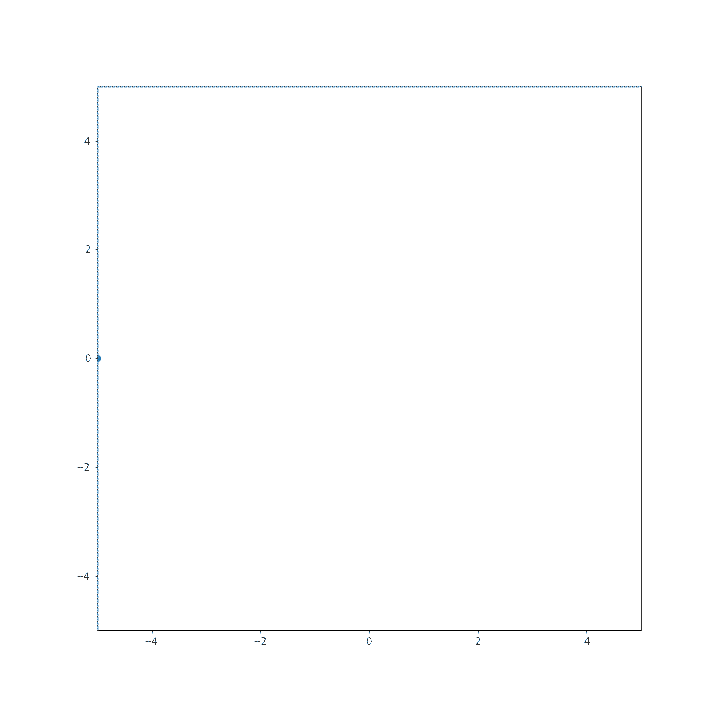

## Una breve introduzione non rigorosa al controllo ottimo
### Riferimenti
- Per un'introduzione semplice senza dimostrazioni: Capitolo 6 di *Introduction to Optimization*, Pedregal
- Per delle dimostrazioni scritte in modo molto diretto: note di Evans, [link](https://math.berkeley.edu/~evans/control.course.pdf)
- Un libro completo: *Functional Analysis, Calculus of Variations and Optimal Control*, Clarke
- Un approccio geometrico al controllo ottimo (servono dei prerequisiti di geometria differenziale): *Control Theory from the Geometric Viewpoint*, Agrachev & Sachkov

## Problema di controllo ottimo

Il tipico *problema di controllo ottimo* è caratterizzato da un (sistema di) ODE (equazioni differenziali ordinarie) in cui l'incognita è una coppia di funzioni $(x(t), u(t))$. Consideriamo un intervallo di tempo $[0,T]$ e $N \geq 1$. La funzione $x \colon [0,T] \to \mathbb{R}^N$ rappresenta una traiettoria nello spazio $\mathbb{R}^N$ e $u \colon [0,T] \to \mathbb{R}^M$ è il cosiddetto *controllo*. 

Il sistema di ODE è della forma 
$$
\left\{
\begin{aligned}
\dot x(t) & = f(x(t),u(t)) \, , \quad t \in [0,T] \, ,\\
x(0) & = x^0 \, ,
\end{aligned}
\right.
$$
dove $x_0$ è un dato iniziale fissato e $f \colon \mathbb{R}^N {\times} \mathbb{R}^M \to \mathbb{R}^N$ e una funzione con una opportuna regolarità. Dato un controllo $u(t)$, esiste una unica soluzione del sistema di ODE (questo è un teorema che vale sotto debolissime ipotesi su $u(t)$, simile al teorema di Cauchy-Lipschitz per le ODE). 

Al sistema di ODE è accoppiato un costo (o guadagno) per il controllo, tipicamente della forma
$$
J(u) := \int_0^T L(t,x(t),u(t)) \, \mathrm{d} t \, ,
$$
dove $x(t)$ è vincolato a essere la soluzione del sistema di ODE dato il controllo $u(t)$. 

**Obiettivo**: lo scopo del problema di controllo ottimo è quello di trovare $u \colon [0,T] \to \mathbb{R}^M$ tale che il costo $J$ sia minimizzato (nel caso in cui $J$ rappresenti un guadagno, lo scopo è quello di massimizzarlo). 

**Costo**: Il costo può avere anche altre forme che rispecchiano diversi obiettivi. Il tempo finale $T$ può anche essere variabile, come è tipico nei problemi di tempo ottimo. 

È più semplice capire questo tipo di problemi guardando degli esempi concreti. 

## Esempi

### Arrivo più economico di un treno alla stazione
**Problema**: Far arrivare un treno ad una stazione spendendo meno costo possibile. 

Scriviamo in modo rigoroso il problema. Il binario è rappresentato dalla retta reale $\mathbb{R}$. Il punto $0 \in \mathbb{R}$ rappresenta la stazione. Denotiamo con $q(t) \in \mathbb{R}$ la posizione del treno al tempo $t$ e denotiamo con $q_0 = q(0)$ la posizione al tempo iniziale $t = 0$, *e.g.*, la stazione di partenza. Il treno è fermo all'inizio, $\dot q(0) = 0$. Possiamo *controllare* l'accelerazione/decelerazione del treno. Il tempo finale $T$ è fissato, *e.g.*, è l'orario di arrivo del treno alla stazione finale. Imponiamo la condizione desiderata: al tempo finale $t = T$ la posizione del treno è alla stazione, quindi $q(T) = 0$, e il treno è fermo $\dot q(T) = 0$.  

*Dinamica*: In conclusione, il sistema è descritto da
$$ 
\left\{
\begin{aligned}
    \ddot q(t) & = u(t) \, , \quad  t \in [0,T] \, , \\
    q(0) &= q^0 \, , \\
    \dot q(0) &= 0 \, , \\
    q(T) &= 0 \, , \\
    \dot q(T) & = 0 \, .
\end{aligned}
\right.
$$


La ODE (del secondo ordine) sembra un po' diversa da quella scritta in generale (del primo ordine). In questi casi si riscrive la ODE come un sistema introducendo una variabile ausiliare $v(t) := \dot q(t)$ (la velocità). In questo modo la ODE diventa 
$$
\left\{
\begin{aligned}
    \dot q(t) & = v(t) \, , \\
    \dot v(t) &= u(t) \, .
\end{aligned}
\right.
$$
cioè, ponendo $x(t) = (q(t),v(t))$ e $f(x,u) = (x_2, u)$,
$$
\left\{
\begin{aligned}
    \dot x(t) & = f(x(t),u(t)) \, , \\
    x_1(0) &= q^0 \, , \\
    x_2(0) &= 0 \, , \\
    x_1(T) &= 0 \, , \\
    x_2(T) &= 0 \, .
\end{aligned}
\right.  \tag{1}
$$

*Costo*: Consideriamo il costo 
$$
J(u) := \int_0^T \frac{1}{2} |u(t)|^2 \, \mathrm{d} t \, .
$$
Questo costo può misurare (in modo quadratico) la quantità di carburante totale consumata. 


*Obiettivo*: Trovare un controllo $u^*(t)$ tale che $J$ sia minimo, cioè $J(u^*) \leq J(u)$ tra tutti i controlli possibili $u$ tali che il sistema $(1)$ viene soddisfatto.

### Arrivo più veloce di un treno alla stazione

Vediamo un esempio di problema in cui il tempo è libero. 

**Problema**: Far arrivare un treno ad una stazione nel minor tempo possibile. 

*Dinamica*: Il sistema è lo stesso di prima, ma questa volta il tempo finale $\tau$ sarà libero (è da trovare)
$$
\left\{
\begin{aligned}
    \dot x(t) & = f(x(t),u(t)) \, ,  \quad  t \in [0,\tau] \, , \\
    x_1(0) &= q^0 \, , \\
    x_2(0) &= 0 \, , \\
    x_1(\tau) &= 0 \, , \\
    x_2(\tau) &= 0 \, .
\end{aligned}
\right.  \tag{2}
$$
dove $f(x,u) = (x_2, u)$.
Assumiamo che l'accelerazione massima sia limitata, ad esempio $|u(t)| \leq 1$ per ogni $t \in [0,\tau]$.

*Costo*: Diciamo che $\tau$ è il primo tempo in cui $x(\tau) = 0$ e consideriamo il costo 
$$
J(u) := \int_0^\tau 1 \, \mathrm{d} t = \tau \, .
$$

*Obiettivo*: Trovare un controllo $u^*(t)$ tale che il relativo $\tau$ sia minimo.


### Soft landing (versione semplice)

**Problema**: Fare atterrare un razzo spendendo meno carburante possibile. 

Consideriamo un razzo che deve atterrare in un tempo $T$ fissato su un pianeta e denotiamo con $h(t)$ la sua posizione rispetto a terra. L'altezza iniziale è $h(0) = h^0$. Denotiamo con $g$ l'accelerazione di gravità del pianeta e con $m$ la massa del razzo. Possiamo controllare il razzo imprimendo una forza $u(t)$ con i propulsori. 

*Dinamica*: Il sistema è descritto da 
$$
\left\{
\begin{aligned}
    m \ddot h(t) & = - m g + u(t) \, , \quad  t \in [0,T] \, , \\
    h(0) &= h^0 \, , \\
    \dot h(0) &= v^0 \, , \\
    h(T) &= 0 \, , \\
    \dot h(T) &= 0 \, .
\end{aligned}
\right.
$$
L'ultima condizione dice che il razzo si ferma a terra.

Anche questo sistema si scrive nella forma 
$$ 
\left\{
\begin{aligned}
    \dot x(t) & = f(x(t),u(t)) \, , \quad  t \in [0,T] \, , \\
    x_1(0) &= h^0 \, , \\
    x_2(0) &= v^0 \, , \\
    x_1(T) &= 0 \, , \\
    x_2(T) &= 0 \, ,
\end{aligned}
\right.
$$
dove $x = (h,v)$ e $f(x,u) = (x_2, -g + \frac{u}{m})$. 

*Costo*: Possiamo considerare costi come 
$$
J(u) = \int_0^T |u(t)| \, \mathrm{d} t \quad \text{oppure} \quad J(u) = \int_0^T \frac{1}{2} |u(t)|^2 \, \mathrm{d} t  \, .
$$

*Obiettivo*: Trovare un controllo $u^*(t)$ tale che $J$ sia minimizzato tra tutti i controlli per cui vale la dinamica descritta sopra. 

### Soft landing (versione sofisticata)

**Problema**: Fare atterrare un razzo spendendo meno carburante possibile, tenendo conto della massa del carburante e con tempo libero. 

Consideriamo un razzo che deve atterrare in un tempo $\tau$ **non** fissato. Questa volta teniamo conto del fatto che la massa del razzo può cambiare nel tempo per la perdita di carburante e denotiamola con $m(t)$. 

*Dinamica*: Il sistema è descritto da 
$$
\left\{
\begin{aligned}
    m(t) \ddot h(t) & = - m(t) g + u(t) \, , \quad  t \in [0,\tau] \, , \\
    \dot m(t) & = - k u(t) \, ,\\
    h(0) &= h^0 \, , \\
    \dot h(0) &= v^0 \, , \\
    h(\tau) &= 0 \, , \\
    \dot h(\tau) &= 0 \, , \\
    m(0) &= m^0 \, .
 \end{aligned}
\right.
$$
La seconda equazione dice il rate di perdita di massa in funzione del carburante usato. 

Anche questo sistema si scrive nella forma 
$$ 
\left\{
\begin{aligned}
    \dot x(t) & = f(x(t),u(t)) \, , \quad  t \in [0,T] \, , \\
    x_1(0) &= h^0 \, , \\
    x_2(0) &= v^0 \, , \\
    x_1(\tau) &= 0 \, , \\
    x_2(\tau) &= 0 \, , \\
    x_3(0) &= m^0 \, .
\end{aligned}
\right.
$$
dove $x = (h,v,m)$ (c'è anche l'incognita $m$) e $f(x,u) = (x_2, -g + \frac{u}{m}, -k m)$. 

*Costo*: Possiamo considerare il costo  
$$
J(u) = m(\tau) \, ,
$$
cioè la massa finale del razzo e $\tau$ è l'istante di atterraggio, cioè tale che $x_1(\tau) = x_2(\tau) = 0$.

*Obiettivo*: Trovare un controllo $u^*(t)$ tale che $J$ sia massimizzato tra tutti i controlli per cui vale la dinamica descritta sopra (cioè il razzo atterra con più massa possibile). 

## Esistenza di controlli ottimi

Supponiamo che $u(t) \in U$ con $U \in \mathbb{R}^M$. Ci sono teoremi di esistenza per i problemi di controllo. Richiedono ipotesi su $f$ e sull'insieme a cui appartengono i controlli $U$. Un'ipotesi importante è che per ogni $x \in \mathbb{R}^N$ l'insieme $\{f(x,u) : u \in U \}$ sia convesso. Si consigliano i riferimenti citati sopra per i teoremi di esistenza (*e.g.*, Teorema di Filippov).

## Condizioni necessarie: il principio di Pontryagin

Per risolvere problemi come quelli descritti sopra (che raramente si riescono a risolvere indovinando il candidato controllo ottimo $u^*$) si cercano delle condizioni necessarie all'ottimalità del controllo. 

\[L'idea non è totalmente nuova: questo è quello che si fa per esempio quando si cercano i minimi di una funzione: raramente si possono trovare "a occhio" i minimi e per questo li si cerca tra i punti critici (un punto di minimo di una funzione regolare è critico!)\]

*Argomento euristico*: Ora proviamo a fornire un argomento **molto informale** per capire quali possono essere le condizioni necessarie per l'ottimalità di un controllo. Nel controllo ottimo si vuole minimizzare un costo $J$ rispetto a $u$ e deve essere rispettato un vincolo: $x$ deve risolvere l'ODE $\dot x = f(x,u)$. Come nella minimizzazione vincolata, introduciamo una nuova traiettoria $p \colon [0,T] \to \mathbb{R}^N$ che funga il ruolo di moltiplicatore di Lagrange. L'idea è di cercare punti critici per 
$$
\int_0^T L(t,x(t),u(t))  - p(t) \cdot \big(\dot x(t) - f(x(t), u(t))\big) \, \mathrm{d} t \, .
$$
Notare che $p$ è scontrata con il vincolo, come si farebbe per la minimizzazione vincolata classica. 

*Attenzione: l'argomento che segue è solamente euristico e non è assolutamente una dimostrazione! Per una dimostrazione si vedano i riferimenti consigliati, e.g., note di Evans.* Consideriamo una perturbazione $(x(t)+\delta x(t), p(t)+\delta p(t), u(t) + \delta u(t))$ di $(x(t),p(t),u(t))$ e imponiamo la condizione di punto critico (trascuriamo i termini di ordine inferiore $\delta^2$): 
$$
\begin{split}
0 & \simeq \int_0^T L(t,x(t)+\delta x(t),u(t)+\delta u(t))  - (p(t)+\delta p(t)) \cdot (\dot x(t) + \delta \dot x(t) - f(x(t)+\delta x(t), u(t) + \delta u(t)) ) \, \mathrm{d} t  - \int_0^T L(t,x(t),u(t))  - p(t) \cdot (\dot x(t) - f(x(t), u(t))) \, \mathrm{d} t \\
& \simeq \int_0^T \nabla_x L(t,x(t),u(t)) \cdot \delta x(t)   + \nabla_u L(t,x(t),u(t)) \cdot  \delta u(t) - \delta p(t) \cdot (\dot x(t) - f(x(t), u(t))) - p(t) \cdot \delta \dot x(t) + \sum_i p_i(t) \nabla_x f_i(x(t), u(t)) \cdot \delta x(t) + \sum_i p_i(t) \nabla_u f_i(x(t), u(t)) \cdot \delta u(t) \\
& \simeq \int_0^T \delta u(t) \cdot \Big( \nabla_u L(t,x(t),u(t)) + \sum_i p_i(t) \nabla_u f_i(x(t), u(t)) \Big) + \delta x(t) \cdot \Big( \dot p(t) + \nabla_x L(t,x(t),u(t)) + \sum_i p_i(t) \nabla_x f_i(x(t), u(t)) \Big) + \delta p(t) \cdot (f(x(t), u(t)) - \dot x(t)) \, \mathrm{d} t - p(T) \cdot \delta x(T) \\
& \simeq \int_0^T \delta u(t) \cdot \Big( \nabla_u H(t,x(t),p(t),u(t)) \Big) + \delta x(t) \cdot \Big( \dot p(t) + \nabla_x H(t,x(t),p(t),u(t)) \Big) + \delta p(t) \cdot (\nabla_p H(t,x(t),p(t),u(t)) - \dot x(t)) \, \mathrm{d} t - p(T) \cdot \delta x(T)
\end{split}
$$
dove abbiamo usato l'integrazione per parti:
$$
- \int_0^T p(t)\cdot \delta \dot x(t) \, \mathrm{d} t  = - p(T)\cdot \delta x(T) + p(0)\cdot \delta x(0) + \int_0^T \dot p(t)\cdot \delta x(t) \, \mathrm{d} t = - p(T)\cdot \delta x(T) + \int_0^T \dot p(t)\cdot \delta x(t) \, \mathrm{d} t \, ,
$$
il fatto che $\delta x(0) = 0$ (anche le traiettorie perturbate partono da $x^0$) e abbiamo definito la cosiddetta *Hamiltoniana*
$$
H(t,x,p,u) := L(t,x,u) + p \cdot f(x,u) \, .
$$
(Se anche il punto finale è fissato, si ha che $\delta x(T) = 0$ e non si impongono condizioni per $p(T)$.)

Siccome la condizione scritta sopra vale per ogni perturbazione, otteniamo che i termini scontrati con $\delta x(t)$, $\delta p(t)$, $\delta u(t)$ nell'integrale devono essere zero, cioè 
$$
\left\{
\begin{aligned}
\dot x(t) & = \nabla_p H(t,x(t),p(t),u(t)) \, , \\
\dot p(t) & = -\nabla_x H(t,x(t),p(t),u(t)) \, , \\
x(0) & = x^0 \, , \\
p(T) & = 0 \, , \\
0 & = \nabla_u H(t,x(t),p(t),u(t))  \, . 
\end{aligned}
\right.
$$

Queste sono condizioni necessarie affinché $u$ sia un controllo ottimo. 

**Principio di Pontryagin**: Più precisamente, si dimostra che un controllo ottimo $u^*(t)$ risolve 
$$
H(t,x^*(t),p^*(t),u^*(t)) \leq H(t,x^*(t),p^*(t),u)  \quad \text{per ogni } u \text{ ammissibile} \, ,
$$
dove $(x^*(t), p^*(t))$ risolve il sistema 
$$
\left\{
\begin{aligned}
\dot x^*(t) & = \nabla_p H(t,x^*(t),p^*(t),u^*(t)) \, , \\
\dot p^*(t) & = -\nabla_x H(t,x^*(t),p^*(t),u^*(t)) \, , \\
x^*(0) & = x^0 \, , \\
p^*(T) & = 0 \, . \\
\end{aligned}
\right.
$$
Queste condizioni sono note come principio di Pontryagin e possono essere usate per cercare i controlli ottimi.


## Esempio
### Arrivo più economico di un treno alla stazione
Applichiamo il principio di Pontryagin per trovare un controllo ottimo per il problema presentato sopra, con dinamica
$$
\left\{
\begin{aligned}
    \dot x(t) & = f(x(t),u(t)) = (x_2(t), u(t)) \, , \\
    x_1(0) &= q^0 \, , \\
    x_1(T) &= 0 \, , \\
    x_2(T) &= 0 \, .
\end{aligned}
\right.   
$$
e costo 
$$
J(u) = \int_0^T \frac{1}{2} |u(t)|^2 \, \mathrm{d} t \, .
$$

*Hamiltoniana*: L'Hamiltoniana del principio di Pontryagin è
$$
H(t,x,p,u) := \frac{1}{2} u^2 + p_1 x_2 + p_2 u
$$
quindi il sistema di ODE in $(x,p)$ da risolvere è 
$$
\left\{
\begin{aligned}
\dot x_1(t) & = \partial_{p_1} H(t,x(t),p(t),u(t)) = x_2(t) \, , \\
\dot x_2(t) & = \partial_{p_2} H(t,x(t),p(t),u(t)) = u(t) \, , \\
\dot p_1(t) & = -\partial_{x_1} H(t,x(t),p(t),u(t)) = 0 \, , \\
\dot p_2(t) & = -\partial_{x_2} H(t,x(t),p(t),u(t)) = - p_1(t) \, ,
\end{aligned}
\right.
$$
con condizioni al bordo (osserviamo che ci sono sia condizioni al tempo $t = 0$ che al tempo $t = T$ che cambiano le condizioni su $p$)
$$
\left\{
\begin{aligned}
x_1(0) & = q^0 \, , \\
x_1(T) & = 0 \, , \\
x_2(0) & = 0 \, , \\
x_2(T) & = 0 \, . \\
\end{aligned}
\right.
$$
e la condizione $\nabla_u H = 0$ implica 
$$
u = - p_2 \, .
$$
Risolviamo il sistema:
$$
\dot p_1(t) = 0 \quad \implies \quad p_1(t) = a \equiv const
$$
$$
\dot p_2(t) = - p_1(t) \equiv - a \quad \implies \quad p_2(t) = - a t - b
$$
$$
\dot x_2(t) = u(t) = - p_2(t) = at + b \quad \implies \quad x_2(t) = \frac{a}{2}t^2 + b t + c \, .
$$
Imponiamo $x_2(0) = x_2(T) = 0$:
$$
0 = x_2(0) = c \, , \quad 0 = x_2(T) =  \frac{a}{2}T^2 + b T \quad \implies \quad  b = - \frac{a}{2}T  \, . 
$$
Continuiamo a risolvere l'ODE:
$$
\dot x_1(t) = x_2(t) = \frac{a}{2}t^2 - \frac{a}{2}T t + c \quad \implies \quad x_1(t) = \frac{a}{6}t^3 - \frac{a}{4}T t^2 + d
$$
Imponiamo $x_1(0) = q^0$ e  $x_1(T) = 0$:
$$
q^0 = x_1(0) = d  \, .
$$
$$
0 = x_1(T) = - \frac{a}{12}T^3 + q^0 \quad \implies \quad a = \frac{12 q^0}{T^3} \, .
$$
In conclusione 
$$
x_1(t) = \frac{2 q^0}{T^3}t^3 - \frac{3 q^0}{T^2} t^2 + q^0 , \quad u(t) =  \frac{12 q^0}{T^3} t - \frac{6 q^0}{T^2}  \, .
$$

Facciamo un plot.


```python
import matplotlib.pyplot as plt 
import matplotlib.animation as animation 
import numpy as np 

%matplotlib inline
```


```python
T = 10
timeSteps = 50
tSample = np.linspace(0,T,timeSteps)

# initial position
q0 = -5

# define the trajectory
x = np.zeros(timeSteps)
for s in range(timeSteps):
    t = tSample[s]
    x[s] = 2*q0/(T*T*T)*t*t*t - 3*q0/(T*T)*t*t + q0

# prepare the plot environment
fig = plt.figure() 
fig.set_size_inches(10,10)
ax = plt.axes(xlim=(-5, 5), ylim=(-5, 5)) 
ax.set_aspect('equal')

lines = []
temp, = ax.plot([], [], marker='o', linestyle="") 
lines.append(temp)

def init():
    #init lines
    for line in lines:
        line.set_data([], [])
    return lines

# define the animation
def animate(t): 	
    lines[0].set_data(x[t], 0)
    return lines

# call the animator	 
anim = animation.FuncAnimation(fig, animate, init_func=init, frames=timeSteps, interval=T) 

# save the animation
anim.save('train.gif')

# watch animation
from IPython.core.display import Image
Image(filename='train.gif')
```


    

    
