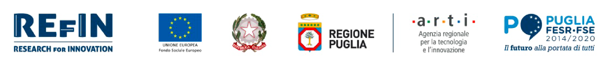
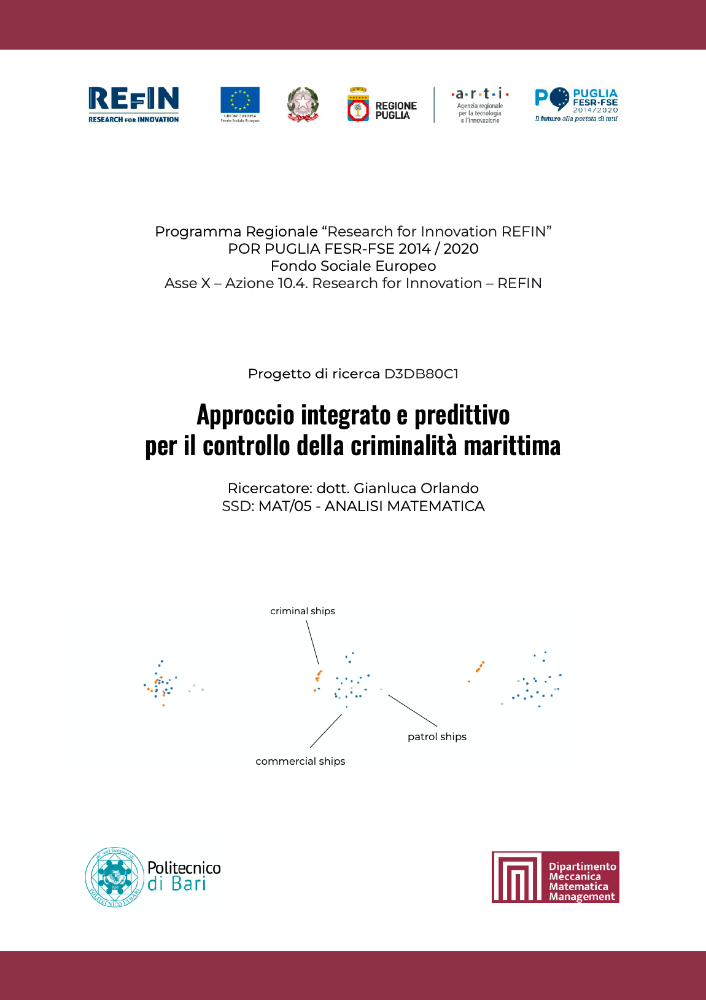

<h2 style="text-align: center;">Progetto Research for Innovation (REFIN)</h2>

 
&nbsp;
 

 
&nbsp;
 

POR PUGLIA FESR-FSE 2014/2020  

Fondo Sociale Europeo  
approvato con Decisione C(2015)5854 del 13/08/2015  
"Research for Innovation (REFIN)"

 

Oggetto: POR Puglia 2014/2020 – Asse X – Azione 10.4. Research for Innovation – REFIN

 
&nbsp;
 

Università: Politecnico di Bari  
Dipartimento: Meccanica, Matematica e Management   &nbsp;  

 Titolo del progetto: 

<h2 style="text-align: center;">Approccio integrato e predittivo per il controllo della criminalità marittima</h2>

 
&nbsp;
 

Codice Pratica: D3DB80C1  

Settore Scientifico Disciplinare (SSD): MAT/05-ANALISI MATEMATICA  

Idea Progettuale di riferimento: POLIBA014 - STRATEGIE DI CONTROLLO DELLA CRIMINALITÀ MARITTIMA  

Ricercatore: Gianluca Orlando

 
&nbsp;
 

### Tema del progetto e risultati attesi

Lo scopo finale del progetto è quello di fornire risultati predittivi nel contesto della salvaguardia delle rotte marittime da attività criminali. A tal fine si svolgerà un'analisi duplice: dal punto di vista teorico si svilupperanno e si studieranno le proprietà di modelli matematici descritti da sistemi multi-specie controllati; dal punto di vista dell'analisi numerica, si sfrutteranno le nozioni teoriche per implementare efficienti simulazioni. Nella fattispecie si analizzeranno sistemi con tre categorie di navi interagenti: navi commerciali, pirata e di pattugliamento controllabili. Tipicamente il numero dei natanti delle prime due categorie è elevato in rapporto a quello dell'ultima, rendendo necessario un approccio multi-scala al problema. Lo scopo finale del progetto sarà pertanto gradualmente raggiunto tramite i seguenti obiettivi parziali: 1) analisi di sistemi discreti di ODE con un numero finito di navi; 2) derivazione di modelli mean-field in termini di sistemi accoppiati PDE/ODE per l'approssimazione nel caso di un numero elevato di navi; 3) analisi discreto-continuo per leggi di traffico volta al perfezionamento dei modelli. Le pubblicazioni teoriche prodotte dal progetto, in sinergia con le simulazioni numeriche implementate, forniranno una comprensione approfondita del problema, idonea a fornire risultati predittivi per le applicazioni.
 

### Pubblicazioni inquadrate nel progetto
1. G. Orlando. Mean-field optimal control in a multi-agent interaction model for prevention of maritime crime. _Preprint_ (2022).
2. M. Cicalese, M. Forster, G. Orlando. Variational analysis of the $$J_1$$-$$J_2$$-$$J_3$$ model: a non-linear lattice version of the Aviles-Giga functional. _Arch. Ration. Mech. Anal._ **245** (2022), 1059–1133.
3. M. Cicalese, G. Orlando, M. Ruf. A classical $$S^2$$-spin system with discrete out-of-plane anisotropy: variational analysis at surface and vortex scalings. _Nonlinear Analysis_ (2022), Article no. 112929.

### Locandina 

