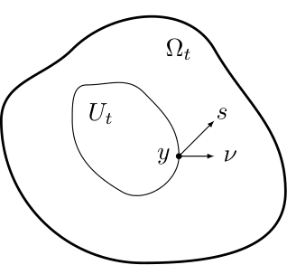
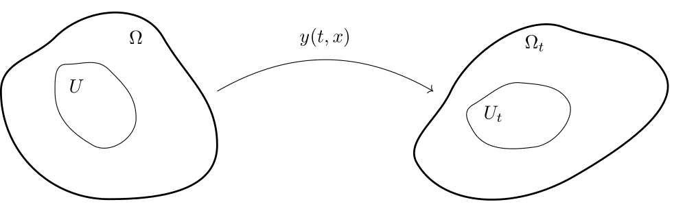
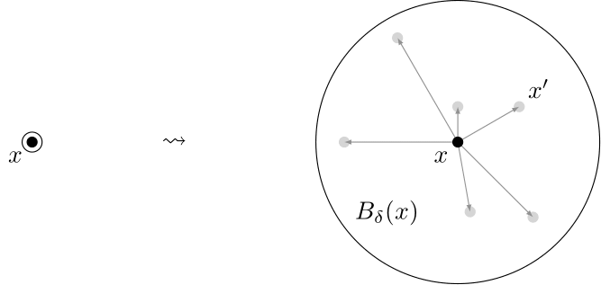
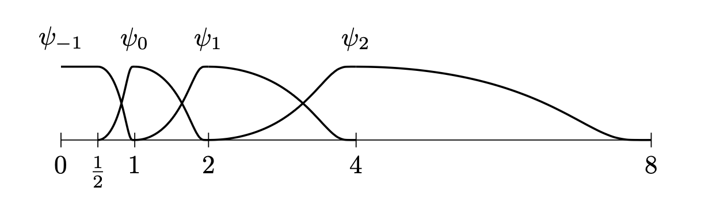

<!--
Editing notes:
- Horizontal slides are separated by a line containing exactly: ---
- Vertical slides are separated by a line containing exactly: --
- Start an ordinary slide with "## Slide title"; initReveal.js turns that into the red slide header.
- Use `$...$` for inline LaTeX and `$$ ... $$` for display LaTeX. Display formulas use `$$` so Markdown preserves the delimiters.
- HTML is kept only where Reveal fragments/stacks or interactive canvas controls need actual elements and ids.
-->

<!-- Horizontal slide -->
<!-- .slide: class="title-slide" -->

# Some remarks on the peridynamics model

### Gianluca Orlando 

Joint works with:
G. M. Coclite (Politecnico di Bari), S. Dipierro (UWA)
F. Maddalena (Politecnico di Bari), E. Valdinoci (UWA)

### INdAM Meeting - Cortona 2026
### Calculus of Variations and Applications to the Real World

##### Cortona - June 10, 2026

---
<!-- Horizontal slide -->

## Classical mechanics

<!-- .element: class="image-small" -->

### Contact forces (Cauchy's hypothesis)

force exerted by $\Omega_t \setminus U_t$ on $U_t$ $ = \displaystyle \int_{\partial U_t} s(t,y,\nu(y)) \, \mathrm{d} \mathcal{H}^{n-1}(y)$

### Cauchy's theorem

$s(t,y,\nu) = T(t,y) \nu$

---
<!-- Horizontal slide -->

## Classical mechanics

<!-- .element: class="image-large" -->

### Balance of linear momentum (no body forces)

In spatial coordinates: $\hspace{0.2cm} \rho \dot v(t,y) - \mathrm{div}_y T(t,y) = 0$, $\hspace{0.2cm} t > 0$, $\hspace{0.2cm} y \in \Omega_t$

In material coordinates: $\hspace{0.2cm} \rho_0 \partial_{tt} y(t,x) - \mathrm{div}_x S(t,x) = 0$, $\hspace{0.2cm} t > 0$, $\hspace{0.2cm} x \in \Omega$

### Constitutive assumptions

Hyperelasticity: $\hspace{0.2cm} \displaystyle S = \frac{\partial W}{\partial F}(F)$, $\hspace{0.2cm} F = \nabla y^\top$, $\hspace{0.2cm} \displaystyle \int_\Omega W(\nabla y) \, \mathrm{d} x$

Prototypical model: $\hspace{0.2cm} \partial_{tt} u(t,x) - \Delta u(t,x) = 0 \hspace{0.2cm}$ (linearization $y = x + \varepsilon u$)

---
<!-- Horizontal slide -->

## Caveats

### Pros:

- Works very well

### Cons:

- No nucleation of discontinuities (cracks)
- No long-range forces
- What if $\nabla u$ is undefined?

---
<!-- Horizontal slide -->

## *Peri* (= "near") + *dynamics* (= "force")

<i class="fa-solid fa-book"></i> S. Silling, *Journal of the Mechanics and Physics of Solids* **48**, 175-209 (2000)

<!-- .element: class="image-medium" -->

### Long-range forces

$$
\mathrm{div}_x S(t,x) \leadsto \int_{B_{\delta}(x)} F(t, x, x', y(t,x),y(t,x')) \, \mathrm{d} x'
$$

### Peridynamic equation of motion

$$
\rho_0 \partial_{tt} y(t,x) - \int_{B_{\delta}(x)} F(t, x, x', y(t,x),y(t,x')) \, \mathrm{d} x' = 0
$$

---
<!-- Horizontal slide -->

## *Peri* (= "near") + *dynamics* (= "force")

### Constitutive assumptions

$\delta > 0$, $\hspace{0.2cm} \alpha \in (0,1)$

$$
\begin{split}
\hspace{-0.5cm} \int_{B_{\delta}(x)} F(t, x, x', y(t,x),y(t,x')) \, \mathrm{d} x' & = \int_{B_{\delta}(x)} f(x'-x, u(t,x')-u(t,x)) \, \mathrm{d} x' \\
& = \mathrm{p.v.} \!  \int_{B_{\delta}(x)} \! \chi_\delta(x'-x)\frac{u(t,x') - u(t,x)}{|x' - x|^{d + 2 \alpha}} \, \mathrm{d} x'
\end{split}
$$

$$
\begin{split}
\hspace{-0.5cm} \int_{B_{\delta}(x)} F(t, x, x', y(t,x),y(t,x')) \, \mathrm{d} x' & = \int_{B_{\delta}(x)} f(x'-x, u(t,x')-u(t,x)) \, \mathrm{d} x' \\
& = \mathrm{p.v.} \!  \int_{B_{\delta}(x)} \! \frac{u(t,x') - u(t,x)}{|x' - x|^{1 + 2 \alpha}} \, \mathrm{d} x' \hphantom{\chi_\delta(x'-x)}
\end{split}
$$

Prototypical model: $\hspace{0.2cm} \displaystyle \partial_{tt} u(t,x) - \mathrm{p.v.}  \int_{B_{\delta}(x)} \frac{u(t,x') - u(t,x)}{|x' - x|^{1 + 2 \alpha}} \mathrm{d} x' = 0$

### Remarks

- $f(x'-x,u'-u) = - f(x-x',u-u')$
- $\displaystyle f(x'-x, u'-u) = \partial_{u'-u} \Big( \frac{1}{2} \frac{|u'-u|^2}{|x'-x|^{1 + 2 \alpha}} \Big)$

---
<!-- Horizontal slide -->

## Objectives

### Prototypical classical waves

$$
\partial_{tt} u(t,x) - \partial_{xx} u(t,x) = 0
$$

### Prototypical peridynamic waves

$$
\partial_{tt} u(t,x) - \mathrm{p.v.}  \int_{B_{\delta}(x)} \frac{u(x') - u(x)}{|x' - x|^{1 + 2 \alpha}} \, \mathrm{d} x' = 0
$$

### Questions

1. Are they related?
2. Does peridynamics allow for discontinuity nucleation?

---
<!-- Horizontal stack: Convergence of operators -->

## Convergence of operators

### Lemma <i class="fa-solid fa-angle-down navigate-down"></i>

For $u \in C^\infty_c(\mathbb{R})$, we have that

$$
K_\delta[u](x) = \frac{1}{\delta^{2(1-\alpha)}} \mathrm{p.v.}  \int_{B_{\delta}(x)} \frac{u(x') - u(x)}{|x' - x|^{1 + 2 \alpha}} \, \mathrm{d} x' \hspace{0.2cm} \stackrel{\delta \to 0}{\longrightarrow} \hspace{0.2cm} \gamma_\alpha^2 \partial_{xx} u(x)
$$

<!-- 

 -->
<!---->
<!-- ### <i class="fa-solid fa-book"></i> Related results -->
<!---->
<!-- Bourgain, Brezis, Mironescu (2001) | Ponce (2004) | Mengesha, Spector (2015) | Bellido, Mora-Corral, Pedregal (2015) | Chambolle, Novaga, Pagliari (2020) | Davoli, Scarpa, Trussardi (2021) | Davoli, Di Fratta, Giorgio (2024) | Cueto, Kreisbeck, Schönberger (2025) | Alicandro, Braides, Solci, Stefani (2025) | Almi, Caponi, Friedrich, Solombrino (2025) | Arroyo-Rabasa (2025) | ... -->
<!---->
--
<!-- Vertical slide -->

## Back-of-the-envelope computation

For $u$ smooth, we have that

$$
\begin{split}
& \mathrm{p.v.}  \int_{B_{\delta}(x)} \frac{u(x') - u(x)}{|x' - x|^{1 + 2 \alpha}} \, \mathrm{d} x' = \mathrm{p.v.}  \int_{\{ |z| \leq \delta \}} \frac{u(x+z) - u(x)}{|z|^{1 + 2 \alpha}} \, \mathrm{d} z \\
& \quad = \mathrm{p.v.}  \int_{\{ |z| \leq \delta \}} \frac{\partial_{x} u(x) z + \frac{1}{2} \partial_{xx} u(x) z^2 + O(|z|^3)}{|z|^{1 + 2 \alpha}} \, \mathrm{d} z \\
& \quad = \delta^{2-2\alpha}  \int_{\{ |w| \leq 1 \}} \frac{\frac{1}{2} \partial_{xx} u(x) w^2}{|w|^{1 + 2 \alpha}} \, \mathrm{d} w + \delta^{3-2\alpha} \int_{\{ |w| \leq 1 \}} \frac{O(1)}{|w|^{1 + 2 \alpha - 3}} \, \mathrm{d} w \\
& \quad = \delta^{2-2\alpha} \frac{1}{2} \partial_{xx}u(x) \int_{\{ |w| \leq 1 \}} |w|^{1-2\alpha} \, \mathrm{d} w + \delta^{3-2\alpha} O(1) \\
& \quad = \delta^{2-2\alpha} \partial_{xx}u(x) \frac{1}{2(1-\alpha)}  + \delta^{3-2\alpha} O(1) \\
& \quad = \delta^{2(1-\alpha)} \gamma_\alpha^2 \partial_{xx}u(x) + \delta^{3-2\alpha} O(1)
\end{split}
$$

hence

$$
K_\delta[u](x) = \frac{1}{\delta^{2(1-\alpha)}} \mathrm{p.v.}  \int_{B_{\delta}(x)} \frac{u(x') - u(x)}{|x' - x|^{1 + 2 \alpha}} \, \mathrm{d} x' = \gamma_\alpha^2 \partial_{xx}u(x) + \delta O(1)
$$

---
<!-- Horizontal stack: Solutions to peridynamic equation -->

## Solutions to peridynamic equation

For well-posedness in a more general setting, see:

<i class="fa-solid fa-book"></i> G. M. Coclite, S. Dipierro, F. Maddalena, E. Valdinoci, *Nonlinearity* **32**, 1 (2018)

In the linear case,

$$
\begin{cases}
\partial_{tt} u(t,x) - K_\delta[u](t,x) = 0 & (t,x) \in (0,+\infty) \times \mathbb{T}^1 \\
u(0,x) = u_0(x) \, , \quad \partial_t u(0,x) = v_0(x) & x \in \mathbb{T}^1
\end{cases}
$$

reads, in Fourier coefficients, <i class="fa-solid fa-angle-down navigate-down"></i>

$$
\begin{cases}
\partial_{tt} \hat u(t,k) + \omega_\delta^2(k) \hat u(t,k) = 0 & (t,k) \in (0,+\infty) \times \mathbb{Z} \\
\hat u(0,k) = \hat u_0(k) \, , \quad \partial_t \hat u(0,k) = \hat v_0(k) & k \in \mathbb{Z}
\end{cases}
$$

Solutions in Fourier space are given by

$$
\hat u(t,k) = \hat u_0(k) \cos(\omega_\delta(k) t) + \frac{\sin(\omega_\delta(k) t)}{\omega_\delta(k)} \hat v_0(k)
$$

--
<!-- Vertical slide -->

## Back-of-the-envelope computation

$$
\begin{split}
& \widehat{K_\delta[u]}(k) = \int_0^1 K_\delta[u](x) e^{-2 \pi i k x} \, \mathrm{d} x \\
& =  \int_0^1 \frac{1}{\delta^{2(1-\alpha)}} \frac{1}{2} \int_{\{|y| \leq \delta\}} \frac{u(x+y) + u(x-y) - 2 u(x)}{|y|^{1 + 2 \alpha}}  e^{-2 \pi i k x} \, \mathrm{d} y \, \mathrm{d} x \\
& = \frac{1}{\delta^{2(1-\alpha)}} \frac{1}{2} \int_{\{|y| \leq \delta\}} \frac{1}{|y|^{1 + 2 \alpha}} \int_0^1 \big( u(x+y) + u(x-y) - 2 u(x) \big) e^{-2 \pi i k x} \, \mathrm{d} x \, \mathrm{d} y \\
& = \frac{1}{\delta^{2(1-\alpha)}} \int_{\{|y| \leq \delta\}} \frac{1}{|y|^{1 + 2 \alpha}} \frac{e^{2 \pi i k y} + e^{-2 \pi i k y} - 2}{2} \hat u(k) \, \mathrm{d} y \\
& = -  \Big( \frac{1}{\delta^{2(1-\alpha)}} \int_{\{|y| \leq \delta\}} \frac{1 - \cos(2 \pi k y)}{|y|^{1 + 2 \alpha}} \, \mathrm{d} y \Big) \hat u(k) \\
& = - \omega_\delta^2(k) \hat u(k)
\end{split}
$$

hence

$$
\omega_\delta(k) = \Big(\frac{1}{\delta^{2(1-\alpha)}} \int_{\{|y| \leq \delta\}} \frac{1 - \cos(2 \pi k y)}{|y|^{1 + 2 \alpha}} \, \mathrm{d} y \Big)^\frac{1}{2}
$$

---
<!-- Horizontal slide -->

## Peridynamic waves

<canvas id="solutionCanvas" width="800" height="300"></canvas>

  

    <label class="label">$\hat u_0(1)$</label>
    <input id="u1" type="range" min="0" max="1" step="0.01" value="1" orient="vertical">
    1.00
  

  

    <label class="label">$\hat u_0(4)$</label>
    <input id="u2" type="range" min="0" max="1" step="0.01" value="0.00" orient="vertical">
    0.00
  

  <label class="checkbox-row">
    <input id="classical" type="checkbox"> classical wave
  </label>

<label class="time-row">
  $t$
  <input id="time" type="range" min="0" max="4" step="0.01" value="0">
  0.00
</label>

---
<!-- Horizontal slide -->

## Energy and solution space

### Lemma

The quantity

$$
\frac{1}{2} \int_{\mathbb{T}^1} |\partial_t u_\delta(t,x)|^2 \, \mathrm{d} x + \frac{1}{2} \int_{\mathbb{T}^1} \int_{B_{\delta}(x)} \frac{|u_\delta(t,x') - u_\delta(t,x)|^2}{|x' - x|^{1 + 2 \alpha}} \, \mathrm{d} x' \, \mathrm{d} x
$$

is conserved along solutions.

### Remark

We have that

$$
\frac{1}{2} \int_{\mathbb{T}^1} \int_{B_{\delta}(x)} \frac{|u(x') - u(x)|^2}{|x' - x|^{1 + 2 \alpha}} \, \mathrm{d} x' \, \mathrm{d} x \sim [u]_{H^\alpha(\mathbb{T}^1)}^2
$$

---
<!-- Horizontal slide -->

## Solutions to peridynamic equation

### Theorem

Let $u_0 \in H^\alpha(\mathbb{T}^1)$, $v_0 \in L^2(\mathbb{T}^1)$.

There exists a unique distributional solution $u_\delta \in L^1_{\mathrm{loc}}((0,+\infty); H^\alpha(\mathbb{T}^1))$ to

$$
\begin{cases}
\partial_{tt} u_\delta(t,x) - K_\delta[u_\delta](t,x) = 0 & (t,x) \in (0,+\infty) \times \mathbb{T}^1 \\
u_\delta(0,x) = u_0(x) \, , \quad \partial_t u_\delta(0,x) = v_0(x) & x \in \mathbb{T}^1
\end{cases}
$$

Moreover, it is given by

$$
u_\delta(t,x) = \sum_{k \in \mathbb{Z}} \Big( \hat u_0(k) \cos(\omega_\delta(k) t) + \frac{\sin(\omega_\delta(k) t)}{\omega_\delta(k)} \hat v_0(k) \Big) e^{2 \pi i k x}
$$

and satisfies $u_\delta \in C([0,+\infty); H^\alpha(\mathbb{T}^1)) \cap C^1([0,+\infty); L^2(\mathbb{T}^1))$.

---
<!-- Horizontal slide -->

## Solutions to peridynamic equation

### Theorem

Let $s \in \mathbb{R}$. Let $u_0 \in H^s(\mathbb{T}^1)$, $v_0 \in H^{s-\alpha}(\mathbb{T}^1)$.

There exists a unique distributional solution $u_\delta \in L^1_{\mathrm{loc}}((0,+\infty); H^s(\mathbb{T}^1))$ to

$$
\begin{cases}
\partial_{tt} u_\delta(t,x) - K_\delta[u_\delta](t,x) = 0 & (t,x) \in (0,+\infty) \times \mathbb{T}^1 \\
u_\delta(0,x) = u_0(x) \, , \quad \partial_t u_\delta(0,x) = v_0(x) & x \in \mathbb{T}^1
\end{cases}
$$

Moreover, it is given by

$$
u_\delta(t,x) = \sum_{k \in \mathbb{Z}} \Big( \hat u_0(k) \cos(\omega_\delta(k) t) + \frac{\sin(\omega_\delta(k) t)}{\omega_\delta(k)} \hat v_0(k) \Big) e^{2 \pi i k x}
$$

and satisfies $u_\delta \in C([0,+\infty); H^s(\mathbb{T}^1)) \cap C^1([0,+\infty); H^{s-\alpha}(\mathbb{T}^1))$.

---
<!-- Horizontal slide -->

## Vanishing horizon

### Theorem [Coclite, Dipierro, Maddalena, O., Valdinoci - SIMA, to appear]

Let $s \in \mathbb{R}$. Let $u_0 \in H^s(\mathbb{T}^1)$, $v_0 \in H^{s-\alpha}(\mathbb{T}^1)$.

Let $u_\delta \in C([0,+\infty); H^s(\mathbb{T}^1)) \cap C^1([0,+\infty); H^{s-\alpha}(\mathbb{T}^1))$ solve

$$
\begin{cases}
\partial_{tt} u_\delta(t,x) - K_\delta[u_\delta](t,x) = 0 & (t,x) \in (0,+\infty) \times \mathbb{T}^1 \\
u_\delta(0,x) = u_0(x) \, , \quad \partial_t u_\delta(0,x) = v_0(x) & x \in \mathbb{T}^1
\end{cases}
$$

Let $u \in C([0,+\infty); H^s(\mathbb{T}^1)) \cap C^1([0,+\infty); H^{s-1}(\mathbb{T}^1))$ solve

$$
\begin{cases}
\partial_{tt} u(t,x) - \gamma_\alpha^2 \Delta u(t,x) = 0 & (t,x) \in (0,+\infty) \times \mathbb{T}^1 \\
u(0,x) = u_0(x) \, , \quad \partial_t u(0,x) = v_0(x) & x \in \mathbb{T}^1
\end{cases}
$$

Then, locally in time,

$$
\| u_\delta - u \|_{L^\infty_t H^s_x} + \|\partial_t u_\delta - \partial_t u \|_{L^\infty_t H^{s-1}_x} \to 0 \quad \text{as } \delta \to 0
$$

---
<!-- Horizontal stack: Dispersion relation -->

## Dispersion relation

<i class="fa-solid fa-book"></i> G. M. Coclite, S. Dipierro, G. Fanizza, E. Valdinoci, *Nonlinearity* **35**, 11 (2022)

$$
\omega_\delta(\xi) = \Big( \frac{1}{\delta^{2(1-\alpha)}}\int_{\{|y| \leq \delta\}} \frac{1 - \cos(2 \pi \xi y)}{|y|^{1+2\alpha}} \, \mathrm{d} y \Big)^\frac{1}{2} \sim \min\{ \gamma_\alpha |\xi|, \lambda_\alpha |\xi|^\alpha \}
$$

<canvas id="dispersionCanvas" width="800" height="300"></canvas>

$\alpha = 0.2$

<label class="range-row">
  $\delta = $
  <input id="delta" type="range" min="0.01" max="0.99" step="0.01" value="0.99">
  0.99
</label>

**Lemma:** <i class="fa-solid fa-angle-down navigate-down"></i> $\hspace{0.2cm}\big| \omega_\delta(\xi) - 2 \pi \gamma_\alpha |\xi| \big| \leq C \delta |\xi|^2$

--
<!-- Vertical slide -->

## Computation

We have that

$$
\begin{split}
& \big| \omega_\delta^2(\xi) - 4 \pi^2 \gamma_\alpha^2 |\xi|^2 \big| = \Big|\frac{1}{\delta^{2(1-\alpha)}} \int_{\{|y| \leq \delta\}} \frac{1-\cos(2\pi \xi y)}{|y|^{1+2\alpha}} \, \mathrm{d} y - \frac{4 \pi^2}{2(1-\alpha)} |\xi|^2\Big| \\
& = \Big|\frac{1}{\delta^{2(1-\alpha)}} \int_{\{|y| \leq \delta\}} \frac{2 \pi^2 |\xi|^2 |y|^2 + O(|\xi|^4|y|^4)}{|y|^{1+2\alpha}} \, \mathrm{d} y - 2 \pi^2|\xi|^2 \int_{\{|w|\leq 1\}} |w|^{1-2\alpha}  \, \mathrm{d} w \Big| \\
& = \Big|2 \pi^2 |\xi|^2  \int_{\{|w| \leq 1\}} \frac{|w|^2 + \delta^2 O(|\xi|^2|w|^4)}{|w|^{1+2\alpha}} \, \mathrm{d} w - 2 \pi^2|\xi|^2 \int_{\{|w|\leq 1\}} |w|^{1-2\alpha}  \, \mathrm{d} w \Big| \\
& \lesssim \delta^2 |\xi|^4 \int_{\{|w| \leq 1\}} |w|^{3-2\alpha} \, \mathrm{d} w \lesssim C \delta^2 |\xi|^4
\end{split}
$$

---
<!-- Horizontal slide -->

## Nucleation of a discontinuity?

In dimension $d=1$

$$
H^\alpha(\mathbb{T}^1) \not\subset C(\mathbb{T}^1) \quad \text{for } \alpha < \frac{1}{2} \, .
$$

In principle, solutions may become discontinuous.

### Question:

Does there exist a solution with a continuous initial datum which evolves into a discontinuous one?

---
<!-- Horizontal slide -->

## Classical waves stay continuous

$$
\partial_{tt} u(t,x) - \Delta u(t,x) = 0 \quad (t,x) \in (0,+\infty) \times \mathbb{T}^1
$$

<canvas id="waveContinuousCanvas" width="800" height="300"></canvas>

<label class="time-row">
  $t$
  <input id="time2" type="range" min="0" max="4" step="0.01" value="0">
  0.00
</label>

$$
u_0 \in H^1(\mathbb{T}^1) \subset C(\mathbb{T}^1) \implies u(t,\cdot) \in H^1(\mathbb{T}^1) \subset C(\mathbb{T}^1) \quad \forall t \geq 0
$$

---
<!-- Horizontal slide -->

## A travelling discontinuity

$$
\partial_{tt} u(t,x) - \Delta u(t,x) = 0 \quad (t,x) \in (0,+\infty) \times \mathbb{T}^1
$$

<canvas id="waveDiscontinuousCanvas" width="800" height="300"></canvas>

<label class="time-row">
  $t$
  <input id="time3" type="range" min="0" max="4" step="0.01" value="0">
  0.00
</label>

---
<!-- Horizontal slide -->

## Numerical example of singularity dissolution in peridynamics

$$
\partial_{tt} u(t,x) - K_\delta[u](t,x) = 0 \quad (t,x) \in (0,+\infty) \times \mathbb{T}^1
$$

<canvas id="peridynamicDiscontinuousCanvas" width="800" height="300"></canvas>

<label class="time-row">
  $t$
  <input id="time4" type="range" min="0" max="10" step="0.01" value="0">
  0.00
</label>

---
<!-- Horizontal slide -->

## Analytical example of singularity dissolution in peridynamics

### Theorem [Coclite, Dipierro, Maddalena, O., Valdinoci - in preparation]

Let $\alpha \in (0,\frac{1}{2})$.

Consider the initial data

$$
u_0(x) = \frac{1}{2} - x \, , \quad v_0(x) = 0 \quad x \in [0,1] \,.
$$

Let $u \in C([0,+\infty); H^\alpha(\mathbb{T}^1)) \cap C^1([0,+\infty); L^2(\mathbb{T}^1))$ be the unique solution to the peridynamic problem.

Then $u(t,\cdot)$ is continuous for all $t > 0$.

---
<!-- Horizontal stack: Proof -->

## Proof

### Explicit expression for the solution

$$
u(t,x) = \sum_{k \neq 0} \frac{\cos(\omega_\delta(k) t)}{i 2 \pi k} e^{i 2 \pi k x}
$$

### Key fact

For all $t > 0$, the trigonometric series

$$
\sum_{k=1}^{+\infty} \frac{1}{k} e^{i 2 \pi k x + i \omega_\delta(k) t}
$$

converges uniformly in $x \in \mathbb{T}^1$.

Proof in the spirit of Van der Corput estimates. <i class="fa-solid fa-angle-down navigate-down"></i>

<i class="fa-solid fa-book"></i> A. Zygmund, *Trigonometric series. Vol. I, II*. Cambridge University Press (1959)

--
<!-- Vertical slide -->

## Main steps

### Step 1: Summation by parts

Set $\displaystyle s_k = \sum_{h=1}^{k} e^{i 2 \pi h x + i h^\alpha t}$ and sum by parts (<a href="#24/1">This will be also useful later on</a>):

$$
\sum_{k=1}^{N} \frac{1}{k} e^{i 2 \pi k x + i k^\alpha t} \approx \frac{1}{N} s_N - \sum_{k=1}^{N} \frac{1}{k^2} s_k \hphantom{ \hspace{0.28em} \approx t^{-1/2} N^{-\alpha/2} + t^{-1/2}\sum_{k=1}^{N} k^{-1-\alpha/2} }
$$

$$
\sum_{k=1}^{N} \frac{1}{k} e^{i 2 \pi k x + i k^\alpha t} \approx \frac{1}{N} s_N - \sum_{k=1}^{N} \frac{1}{k^2} s_k \approx t^{-1/2} N^{-\alpha/2} + t^{-1/2}\sum_{k=1}^{N} k^{-1-\alpha/2} 
$$

### Step 2: Compare sum and integral

$$
s_N \approx \int_1^N e^{i 2 \pi \xi x + i \xi^\alpha t} \, \mathrm{d} \xi
$$

### Step 3: Study the oscillatory integral (the key estimate)

$$
\Big|\int_1^N e^{i 2 \pi \xi x + i \xi^\alpha t} \, \mathrm{d} \xi\Big| \lesssim t^{-1/2}N^{1-\alpha/2}
$$

---
<!-- Horizontal stack: From qualitative to quantitative: Norm blow-up -->

## From qualitative to quantitative: Norm blow-up

Consider the solution $u(t,x)$ constructed in the previous example.

### Question
- Can we find a (meaningful) norm $\lVert \cdot \rVert_X$ such that $\lVert u(t,\cdot) \rVert_X \xrightarrow{t\to 0^+} +\infty$?

### Remarks

- A Sobolev norm $\lVert \cdot \rVert_{H^s(\mathbb{T}^1)}$ cannot work: <i class="fa-solid fa-angle-down navigate-down"></i>

$$
\begin{split}
& \text{1) } \lVert u_0 \rVert_{H^s(\mathbb{T}^1)} < +\infty \implies \lVert u(t,\cdot) \rVert_{H^s(\mathbb{T}^1)} < +\infty \quad \text{for all } t > 0 \\ 
& \text{2) } \lVert u(t,\cdot) \rVert_{H^s(\mathbb{T}^1)} < +\infty \quad \text{for some } t > 0 \implies \lVert u_0 \rVert_{H^s(\mathbb{T}^1)} < +\infty 
\end{split}
$$

- A Hölder norm $\lVert \cdot \rVert_{C^{0,s}(\mathbb{T}^1)}$ would be meaningful, but it is hard to work with. 

--
<!-- Vertical slide -->

## A Sobolev norm $\lVert \cdot \rVert_{H^s(\mathbb{T}^1)}$ cannot work

Recalling the formula for the solution 

$$
\hat u(t,k) = \cos(\omega_\delta(k) t) \hat u_0(k) \, , \quad \text{for } k \neq 0 
$$

we have that

$$
\begin{split}
\lVert u(t,\cdot) \rVert_{H^s(\mathbb{T}^1)}^2 & = \sum_{k \neq 0} (1 + |k|^2)^s \cos^2(\omega_\delta(k)t)| \hat u_0(k)|^2 \\ 
    & \leq \sum_{k \neq 0} (1 + |k|^2)^s |\hat u_0(k)|^2 = \lVert u_0 \rVert_{H^s(\mathbb{T}^1)}^2 
\end{split}
$$

For the converse: the equation is reversible. Use $u(t,\cdot)$ (and its velocity) as initial datum and evolve backwards until time $0$.

---
<!-- Horizontal slide -->

## Size across frequencies (an introduction to Besov norms)

<!-- .element: class="image-large" -->

### Littlewood-Paley decomposition

$$
P_j u(t,x) = \sum_{k \in \mathbb{Z}} \psi_j(k) \hat u(t,k) e^{i 2 \pi k x} \implies u(t,x) = \sum_{j \geq -1} P_j u(t,x)
$$

$$
\begin{aligned}
P_j u(t,x)
&= \sum_{2^{j-1} \leq |k| \leq 2^{j+1}} \psi_j(|k|) \hat u(t,k)e^{i k \cdot x} \\
&= \frac{1}{\pi} \sum_{k = 2^{j-1}}^{2^{j+1}} \psi_j(k) \frac{1}{k}\cos(\omega_\delta(k)t)\sin(2 \pi k x)
\end{aligned}
$$

---
<!-- Horizontal slide -->

## Size across frequencies (an introduction to Besov norms)

We consider the Besov norm 

$$
\lVert u(t,\cdot) \rVert_{B^s_{\infty,\infty}(\mathbb{T}^1)} = \sup_{j \geq -1} 2^{s j} \lVert P_j u(t,\cdot) \rVert_{L^\infty(\mathbb{T}^1)} \quad \text{for } s \in (0,1)
$$

<canvas id="holderFrequencyCanvas" width="860" height="250"></canvas>

  <label class="range-row">
    $t$
    <input id="holderTime" type="range" min="0" max="4" step="0.01" value="4">
    0.000
  </label>
  <label class="range-row">
    $j$
    <input id="holderJ" type="range" min="0" max="7" step="1" value="0">
    4
  </label>
  

    $k = 8,\ldots,32$
    $\lVert P_j u\rVert_\infty = 0$
  

### Lemma 

$$
\lVert u(t,\cdot) \rVert_{B^s_{\infty,\infty}(\mathbb{T}^1)} \approx \|u(t,\cdot)\|_{C^{0,s}(\mathbb{T}^1)} \quad \text{for } s \in (0,1)
$$

---
<!-- Horizontal slide -->

## Besov norm blow-up

### Theorem [Coclite, Dipierro, Maddalena, O., Valdinoci - in preparation] <i class="fa-solid fa-angle-down navigate-down"></i>

Let $\alpha \in (0,\frac{1}{2})$. Let $s \in (0, \frac{\alpha}{2})$.

Consider the initial data

$$
u_0(x) = \frac{1}{2} - x \, , \quad v_0(x) = 0 \quad x \in [0,1] \,.
$$

Let $u \in C([0,+\infty); H^\alpha(\mathbb{T}^1)) \cap C^1([0,+\infty); L^2(\mathbb{T}^1))$ be the unique solution to the peridynamic problem.

Then

$$
t^{-s/\alpha} \lesssim \lVert u(t,\cdot) \rVert_{B^s_{\infty,\infty}(\mathbb{T}^1)} \lesssim t^{-s/\alpha} \quad \text{as } t \to 0^+
$$

--
<!-- Vertical slide -->

## Besov norm blow-up (sketch of proof)

### Upper bound

Exploit the <a href="#/20/1/1">Van der Corput-type estimate</a> 

$$
P_j u(t,x) \approx \sum_{k = 2^{j-1}}^{2^{j+1}} \psi_j (k) \frac{1}{k} e^{i 2 \pi k x + i \omega_\delta(k) t} \approx t^{-1/2} 2^{-j \alpha/2} \wedge 1   
$$

to deduce the bound 

$$
2^{s j} ( t^{-1/2} 2^{-j \alpha/2} \wedge 1 ) \lesssim t^{-s/\alpha}
$$ 

by distinguishing the cases $2^j \lesssim t^{-1/\alpha}$ and $2^j \gtrsim t^{-1/\alpha}$.

### Lower bound

Use the explicit expression

$$ 
P_j u(t,x) = \frac{1}{\pi} \sum_{k = 2^{j-1}}^{2^{j+1}} \psi_j(k) \frac{1}{k}\cos(\omega_\delta(k)t)\sin(2 \pi k x) 
$$ 

and, for every $t > 0$, find $j$ and $x_j$ such that $\cos(\omega_\delta(k)t)\sin(2 \pi k x) > c_0 > 0$. 

---
<!-- Horizontal slide -->
<!-- .slide: class="title-slide closing-slide" -->

# Thank you for the attention
